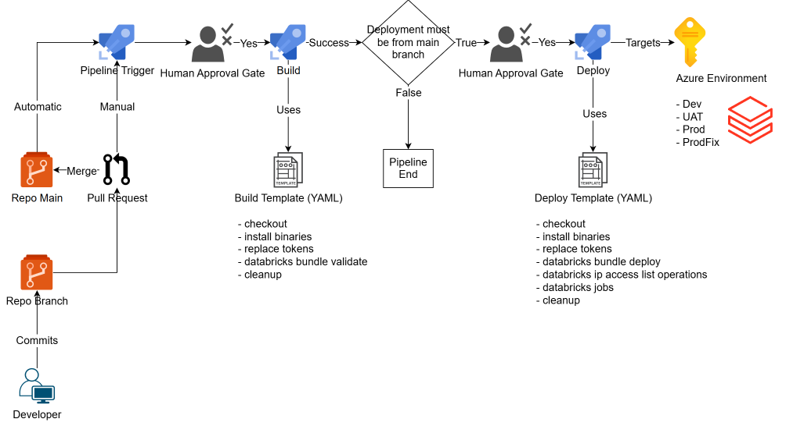

# Azure Databricks CICD

This repo contains example Azure Databricks CICD patterns using Databricks CLI and YAML pipelines



# Databricks Workspace IP Access Lists

The `./workspace-ip-access-lists` folder in this repo contains the `.json` files that are used by the `ado-release-template.yml` devops template file to manage IP access lists for the workspace respective to each databricks environment.

Key References:
- https://learn.microsoft.com/en-us/azure/databricks/security/network/front-end/ip-access-list
- https://docs.databricks.com/en/security/network/front-end/ip-access-list-workspace.html
- https://learn.microsoft.com/en-us/azure/databricks/security/network/front-end/ip-access-list-workspace

## JSON File Properties

| Input name        | Type   | required                                 | example                                    |
| ----------------- | ------ | ---------------------------------------- | ------------------------------------------ |
| label             | string | yes for `Create` and `Update` operations | `"ALLOW_AZURE_DATABRICKS_PRODFIX_SUBNETS"` |
| list_type         | string | yes for `Create` and `Update` operations | `"ALLOW"` or `"BLOCK"`                     |
| ip_addresses      | array  | yes for `Create` and `Update` operations | `["10.0.0.0/25","10.0.100.0/25"]`          |
| ip_access_list_id | string | yes for `Update` and `Delete` operations | `"a559572d-1730-4ce4-203z-75506242f04h"`   |
| operation         | string | yes always                               | `"CREATE"` or `"UPDATE"` or `"DELETE"`     |

## How To


**Enable or Disable IP access lists**

```yml
  - stage: Release_PRD
    displayName: "Release PRD"
    dependsOn: [Build_PRD]
    condition: ${{ variables.Condition }}
    jobs:
      - template: /devops/templates/ado-release-template.yml@self
        parameters:
          BUNDLE_TARGET: "prd"
          ADB_HOST: $(ADB_PRD_HOST)
          ADB_CLIENT_ID: $(ADB_PRD_SPN_ID)
          ADB_CLIENT_SECRET: $(ADB_PRD_SPN_SECRET)
          ADB_ENABLE_IP_ACCESS_LISTS: false #Update to true if you want to enable IP access lists for the Databricks workspace
          DATABRICKS_SDK_VERSION: ${{ variables.DATABRICKS_SDK_VERSION }}
          DATABRICKS_LOG_LEVEL: ${{ variables.DATABRICKS_LOG_LEVEL }}
          ADB_JOB_NAMES: "init_job"
          ADO_ENVIRONMENT: "Prod-Databricks"
          AGENT_POOL: ${{ variables.AGENT_POOL }}
```


**Create a new access list**

```json
[
  {
    "label": "ALLOW_EXAMPLE_CORP_NETWORK1",
    "list_type": "ALLOW",
    "ip_addresses": ["192.168.0.0/23"],
    "operation": "CREATE"
  }
]
```

**Update an existing access list**

- note: the required `ip_access_list_id` value can be retrieved from a previous build or release pipeline run (within the 'Check/Configure Databricks IP Access Lists' step)

```json
[
  {
    "label": "ALLOW_EXAMPLE_CORP_NETWORK1",
    "list_type": "ALLOW",
    "ip_addresses": ["192.168.0.0/23", "192.168.100.0/23"],
    "ip_access_list_id": "a559572d-1730-4ce4-203z-75506242f04h",
    "operation": "UPDATE"
  }
]
```

**Delete an existing access list**

- note: the required `ip_access_list_id` value can be retrieved from a previous build or release pipeline run (within the 'Check/Configure Databricks IP Access Lists' step)

```json
[
  {
    "label": "ALLOW_EXAMPLE_CORP_NETWORK1",
    "list_type": "ALLOW",
    "ip_addresses": ["192.168.0.0/23", "192.168.100.0/23"],
    "ip_access_list_id": "a559572d-1730-4ce4-203z-75506242f04h",
    "operation": "DELETE"
  }
]
```
